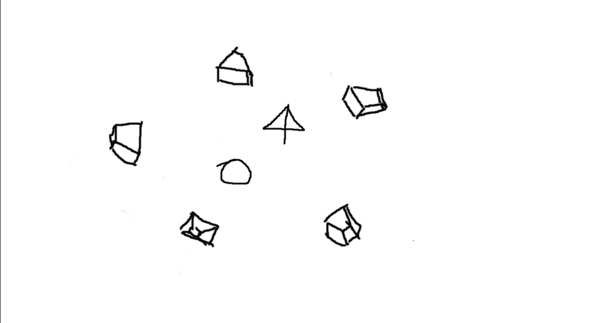
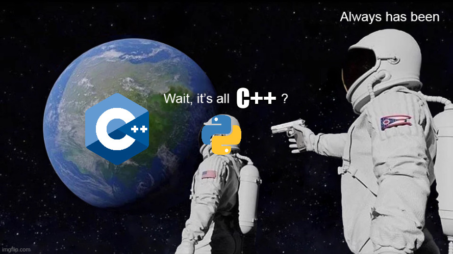
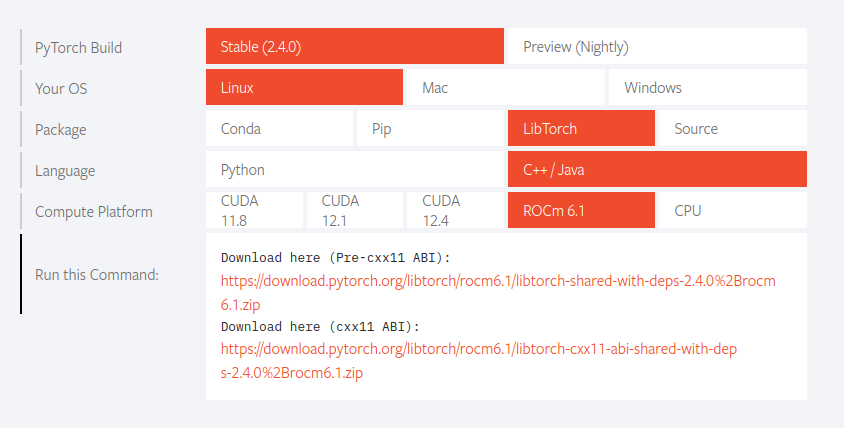
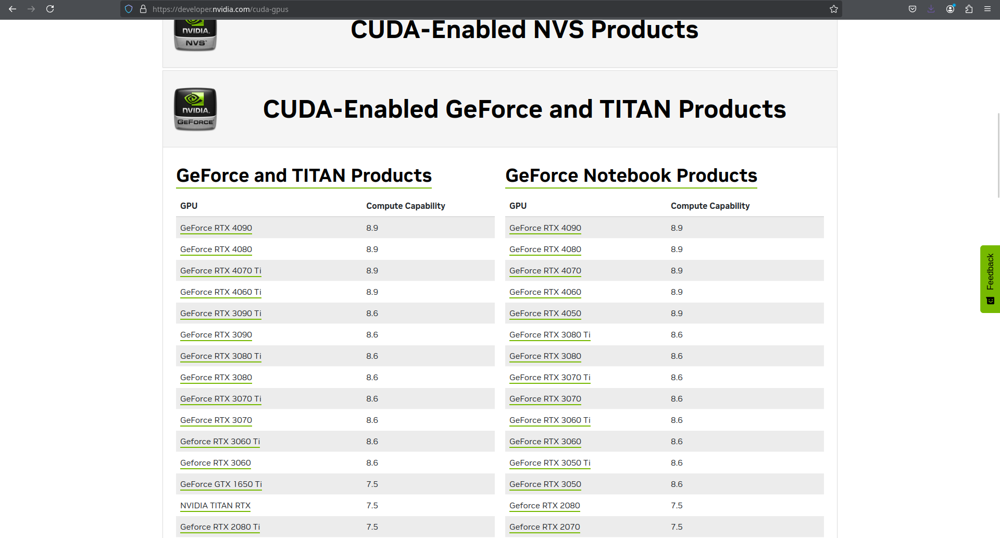

# Introduction   
## Preamble: Structure of the lesson and Approach   
   
Artificial Intelligence is everywhere, with a special focus on LLMs. However, computer graphics are also being influenced by AI, offering significant potential for new methods and technologies. This is the first lesson on Scratchapixel that connects AI with computer graphics, and we chose one of the most fascinating applications: Neural Radiance Fields, or NeRF for short.

We have always aimed to provide code snippets and implementations without relying on third-party dependencies. However, when it comes to AI, things get a bit tricky, as AI itself could almost be considered its own platform (think of Scratchapixel but for AI). While we hope to address this in the future, we ask for your understanding regarding some 'black boxes' in the meantime. For the first time on Scratchapixel, readers will need to set up a development environment to follow along with the lessons. But don’t worry—we’ll guide you through every step to ensure your environment is ready.

So, what exactly is a NeRF? As mentioned, NeRF stands for Neural Radiance Fields. It refers to a type of neural network that approximates a volumetric representation of a scene, trained from RGB images, and is capable of rendering novel views.

If that doesn't sound familiar, don't worry. Let’s start with the problem that NeRF solves.   
## The Problem   
Imagine you have a collection of photos of a scene. As humans, we can easily infer the nature of the scene just by looking at the images—we perceive depth, position, lighting, and other characteristics. However, for a computer, these images are just arrays of numbers representing colors. All the depth information, lighting, and other spatial clues are lost in the process of rendering the images. As a result, reconstructing a 3D scene from a set of 2D photos becomes a challenging computational problem.   
    
   
The primary goal of NeRF is to represent a 3D scene from a series of 2D images. It’s important to note that other techniques existed prior to NeRF that could achieve this, but they came with limitations. Let’s briefly explore those methods.   
    
   
## The "Classical" approach   
   
Generating 3D scenes from images isn’t a new concept—many computer vision techniques predate NeRF and have been used to reconstruct 3D representations These techniques fall into what is known as ***photogrametry***. This field often includes techniques such as, feature extraction, image matching, feature matching, **Structure from Motion (SFM)** and many more. When combined, these methods can generate a 3D mesh that matches the scene from the images.   
If you are curious, there is an open source framework called [AliceVision](https://alicevision.org/) you can try and explore. However, photogrammetry has some limitations. For example, reflections and transparent objects are problematic, and in some cases, specialized hardware is required to get an accurate 3D representation.    
This is where NeRF comes into play, offering a neural network-powered alternative to address these limitations.   
## The NeRF approach   
   
The idea behind NeRF is straightforward: use a neural network trained with images to represent a 3D scene. This falls into what is known as ***Neural Graphics Primitives*** or ***NPG*** for short. NGP refers to the use of neural networks to represent digital signals, such as images or, in this case, volumes. [Max Slater](https://thenumb.at/Neural-Graphics/)  has a great article that delves into this topic, but here’s a quick summary.   
Neural networks are typically used to generalize a problem. However this is not the case for NGPs. For the NGPs the goal is to ***over-fit*** the network and make it memorize the content. For example you could traing a network to learn an image and later use it to query different points of the image to render it.   
NeRFs take this concept and apply it to render a complete 3D scene from RGB images. The network is capable of modeling light and high frequency details without some of the drawbacks of classical photogrammetry techniques. The first NeRF references dates 2020 ([link](https://arxiv.org/abs/2003.08934))  and skyrocketed a lot of research on the matter but a lot of it comes from the basic idea of NeRFs.   
In contrast to traditional approaches, NeRF diverges in several key ways. Throughout the following lessons, we will break down the technique piece by piece. By the end, you’ll have a clear understanding of how NeRF works and will even create your own implementation from scratch.   
   
## Dev environment   
    
   
As we mentioned at the beginning, for these lessons we'll need to prepare a suitable environment and unlike all the tutorials you can find online, we'll stick with C++. No worries, the C++ API is very similar to the Python one so it will be easy to go from one to another. With all that said, this is what we need:
   
**Must**    
- GCC 9 or newer (Microsoft Visual C++ if you are on windows)   
- CMake   
- libtorch   
   
**For GPU support**    
- CUDA if you have nvidia   
- ROCm if you have AMD   
   
   
**NOTE**: Unfortunately ROCm doesn't support windows so unless you want to switch to linux (although we recommend doing it for machine learning stuff) you'll have to use the CPU only version of Pytorch.   
**ANOTHER NOTE:** Pytorch don't support Intel ARC GPUs so you also have to stay with the CPU only version   
## Libtorch   
   
Libtorch is the C++ front end of pytorch and you can download it from the official page ([https://pytorch.org/](https://pytorch.org/)). Make sure to select **Libtorch** and the **C++/Java**  options. Download the **with-dep** version.   
    
   
Once it's downloaded unzip it on an easy to remember folder and save th**e absolute path** of the unziped folder. This will be our **-DCMAKE\_PREFIX\_PATH**  that we'll need to configure later with CMake. If you are using libtorch wit**h cuda** you also need to know you**r -DCMAKE\_CUDA\_ARCHITECTURES**, check out the official Nvidia cuda website ([https://developer.nvidia.com/cuda-gpus](https://developer.nvidia.com/cuda-gpus)) and look for your GPU.   
   
    
   
## Setting up a project   
   
From here, is easy to set up a project, in our project folder create a `CMakeLists.txt` file with the following content:   
   
```
cmake_minimum_required(VERSION 3.18 FATAL_ERROR) # Set minimun CMake version
project(example-app) # Set project name

set(CMAKE_EXPORT_COMPILE_COMMANDS ON) # Enable export of compile commands to compile_commands.json

find_package(Torch REQUIRED) # Locates the PyTorch library and sets up the necessary variables to link against it.

set(CMAKE_CXX_FLAGS "${CMAKE_CXX_FLAGS} ${TORCH_CXX_FLAGS}") # Appends the Torch-specific compiler flags to the existing C++ compiler flags.

add_executable(example-app example-app.cpp) # Defines the executable target that will be built from the specified source ../../images/NeRF.

target_link_libraries(example-app "${TORCH_LIBRARIES}") # Links the necessary Torch libraries to the example-app target.

set_property(TARGET example-app PROPERTY CXX_STANDARD 17) # Specifies the C++ standard to be used for compiling the target.

# The following code block is suggested to be used on Windows.
# According to https://github.com/pytorch/pytorch/issues/25457,
# the DLLs need to be copied to avoid memory errors.
if (MSVC)
  file(GLOB TORCH_DLLS "${TORCH_INSTALL_PREFIX}/lib/*.dll")
  add_custom_command(TARGET example-app
                     POST_BUILD
                     COMMAND ${CMAKE_COMMAND} -E copy_if_different
                     ${TORCH_DLLS}
                     $<TARGET_FILE_DIR:example-app>)
endif (MSVC)

```
    
   
This is a simple CMake file and we'll have to update it as we progress in the lessons. For now this will help us to test that our environment is ready.   
   
With the `CMakeLists.txt`  lets use a simple example. Create an `example-app.cpp` file and paste the following code   
```
a#include <torch/torch.h> // Import torch
#include <iostream> // Import standar io

int main() {
  torch::Tensor tensor = torch::rand({2, 3}); // Here we are creating a tensor with random data
  std::cout << tensor << std::endl; // Print it to the std out
}
```
   
All what we are doing on the code is instantiating a simple tensor and printing it out to the standard output. We are almost ready, now we can try to compile the program and execute it.   
   
## Building the project   
   
First we want to configure our build directory:   
   
```
mkdir build
cd build
cmake -DCMAKE_PREFIX_PATH=/absolute/path/to/libtorch ..	
cmake --build . --config Release
```
   
If you are using CUDA and get an error like this:   
   
```
CMake Error at /usr/share/cmake/Modules/Internal/CMakeCUDAArchitecturesValidate.cmake:7 (message):
  CMAKE_CUDA_ARCHITECTURES must be non-empty if set.
Call Stack (most recent call first):
  /usr/share/cmake/Modules/CMakeDetermineCUDACompiler.cmake:112 (cmake_cuda_architectures_validate)
  /home/mashi/nonPackageStuff/libtorch/share/cmake/Caffe2/public/cuda.cmake:47 (enable_language)
  /home/mashi/nonPackageStuff/libtorch/share/cmake/Caffe2/Caffe2Config.cmake:86 (include)
  /home/mashi/nonPackageStuff/libtorch/share/cmake/Torch/TorchConfig.cmake:68 (find_package)
  CMakeLists.txt:4 (find_package)

```
   
Then you need to change the third command to:   
```
cmake -DCMAKE_CUDA_ARCHITECTURES="<your compute comatibility>" -DCMAKE_PREFIX_PATH=/absolute/to/libtorch ..

```
Just make sure to add the architecture without the point, for example   
```
cmake -DCMAKE_CUDA_ARCHITECTURES="61" -DCMAKE_PREFIX_PATH=/absolute/to/libtorch ..
```
   
If everything goes as planned you should see something like this:   
```
root@4b5a67132e81:/example-app# mkdir build
root@4b5a67132e81:/example-app# cd build
root@4b5a67132e81:/example-app/build# cmake -DCMAKE_PREFIX_PATH=/path/to/libtorch ..
-- The C compiler identification is GNU 5.4.0
-- The CXX compiler identification is GNU 5.4.0
-- Check for working C compiler: /usr/bin/cc
-- Check for working C compiler: /usr/bin/cc -- works
-- Detecting C compiler ABI info
-- Detecting C compiler ABI info - done
-- Detecting C compile features
-- Detecting C compile features - done
-- Check for working CXX compiler: /usr/bin/c++
-- Check for working CXX compiler: /usr/bin/c++ -- works
-- Detecting CXX compiler ABI info
-- Detecting CXX compiler ABI info - done
-- Detecting CXX compile features
-- Detecting CXX compile features - done
-- Looking for pthread.h
-- Looking for pthread.h - found
-- Looking for pthread_create
-- Looking for pthread_create - not found
-- Looking for pthread_create in pthreads
-- Looking for pthread_create in pthreads - not found
-- Looking for pthread_create in pthread
-- Looking for pthread_create in pthread - found
-- Found Threads: TRUE
-- Configuring done
-- Generating done
-- Build ../../images/NeRF have been written to: /example-app/build
root@4b5a67132e81:/example-app/build# cmake --build . --config Release
Scanning dependencies of target example-app
[ 50%] Building CXX object CMake../../images/NeRF/example-app.dir/example-app.cpp.o
[100%] Linking CXX executable example-app
[100%] Built target example-app

```
   
Finally we can execute the result that should be in the `build`  directory:   
   
```
root@4b5a67132e81:/example-app/build# ./example-app
0.2063  0.6593  0.0866
0.0796  0.5841  0.1569
[ Variable[CPUFloatType]{2,3} ]
```
   
**NOTE:** From the official docs. On Windows, debug and release builds are not ABI-compatible. If you plan to build your project in debug mode, please try the debug version of LibTorch. Also, make sure you specify the correct configuration in the `cmake --build .` line above.   
   
## Can we start now?   
If you have the above example working means that your environment is ready and we can finally proceed to build our NeRF. Make sure to check the previous knowledge section and understand at least a little each topic.   
