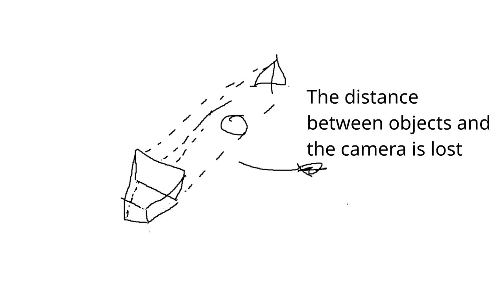

# Some optimization considerations   
Assuming we have our neural network trained and ready to query data for rendering an image, we face two major challenges: performance and preserving high-frequency details. First, using a neural network to get our data is pretty costly on its own. Furthermore, when sampling rays, densely sampling rays across the entire scene would be inefficient and will lead to performance degradation without effectively capturing fine details. **Hierarchical sampling** addresses this by first performing a coarse sampling to approximate regions of interest and then refining the sampling more densely in areas with significant color and density variations. This enables the network to focus resources on key regions, reducing the amount of sampling needed while gathering enough significant data to avoid detail loss.    
     
While hierarchical sampling reduces some performance penalties, neural networks still struggle with high frequency details. To address this P**ositional Encoding** is applied, mapping input coordinates to a higher-dimensional space. This allows the neural network to capture fine-grained variations in scene geometry and appearance. Both techniques represent a significant improvements in NeRFs and are key to achieve high-quality rendering.   
   
In this lesson we will dive into how these techniques are employed in NeRFs, integrate them into our training and rendering pipeline and finally give a detail view on the theory behind those techniques.   
## Hierachical Sampling   
   
We want to be smart in how we sample our data since sampling can have a huge impact both in detail and performance. On one hand, we want to sample enough data to produce a high-quality rendering and maintain as much detail as possible. On the other hand, if we try to make too many queries to the network our performance will decrease significantly.  What we want is to take multiple samples from locations that have an object, but if we are sampling an empty space then we are okay with just a few samples from that area.   
   
    
   
With hierachical sampling we can divide the process into two steps. A coarse sample, where we take a handful of samples without worrying too much what we are sampling. Think of this as a kind of an exploratory sampling. And the second step is a fine sampling, where we take the results of the coarse sampling and use it as a guide of where we should sample next.    
First let's take a look at our volumetric rendering equation:   
   

$$
T_i = exp (  - \sum_{j=1}^{i-1}\sigma_j \delta_j)
$$

$$
L(c,w) = \sum_{i=1}^N ( 1 - exp(-\sigma_i \delta_i))L_s

$$
   
If we rearrange our equation we can think of this as the combination of different colors with corresponding weight:   

$$
w_i = T_i(1 - exp(-\sigma_i \delta_i))
$$

$$
L(c,w) = \sum_{i=1}^N w_iL_s

$$
This means that each color has some degree of contribution to the final result. With that in mind, we want to sample areas with more weight, since those are the ones with higher influence in the result.   
   
To achieve this we borrow a technique from statistics called **Inverse Transform Sampling. **[Here](https://www.youtube.com/watch?v=9ixzzPQWuAY) you can find a very good explanation about how this method works but here is the quick version. First, we have some data that follows an uniform distribution and we want to fit them to a distribution described by its PDF. To do that we just invert the corresponding CDF and, because of math, the uniform data will be forced to follow the PDF.    
   
    
   
First, we need our PDF. If we graph our weights, we can interpret this as the distribution of particles trough space. A higher weight means more particles in that area, hence, the more sample we want from there. With that notion, we just have to normalize our weights and we end up with a piecewise constant PDF that describes the distribution of where we should focus our samples.   
   
    
   
A more formal definition of this PDF would look something like this:   
   

$$
PDF(s) = 
\begin{cases} 
w_1 &  s_0 \leq s < s_1, \\
w_2 &  s_1 \leq s < s_2, \\
\vdots & \vdots \\
w_n &  s_{n-1} \leq s \leq s_{n}.
\end{cases}
$$
   
   
And the code to get our PDF es fairly easy. We just have to take our densities from the coarse sample and normalize them. That would look something like this:   
   
```cpp
double *sample_pdf(const double *bins, double *weights, int N_weights,
                   int N_samples, bool det = false) {

  // Get pdf by normalizing the weights
  // Add small epsilon to each weight to prevent division by zero
  double sum = 0.0;
  for (int i = 0; i < N_weights; i++) {
    weights[i] += 1e-5;
    sum += weights[i];
  }

  // Calculate PDF 
  double *pdf = new double[N_weights];

  for (int i = 0; i < N_weights; i++) {
    pdf[i] = weights[i] / sum;
  }
}
```
   
Now we need to generate our CDF. But before going deep into the math on how to get there we want to build an intuitive notion. First we need to understand what a CDF or Cumulative Distribute function is. A CDF is a function that describes the probability of a variable (again, an statistical variable) being less or equal than a certain value x. You can see this as a fancy way to describe the sum of probabilities up to a point x. But how do we build that from our CDF?   
When we look at the plot of a simple PDF, we notice that is build from a set of rectangles that are bound by our coarse sample points and weights. From here is easy to see that the CDF can be build by simply adding the rectangles along our sampling area yielding something like this:   
    
Under this notion, we can compute the values of our CDF by simply adding the values from our PDF accordingly. Something like this:   

$$
CDF_{s_i} = CDF_{s_{i-1}} + PDF_{s_i}

$$
From here, our goal is to reverse this function. If we look at the previous image, we can sew that the Y−axis represents the accumulated probability (the CDF value at a point x) while the X−axis the range of our random variable (the statistical one), in our case the distance represented by the $s\_i$​ points.   
The range of the CDF goes from $[0,1]$. So, the idea is to take a Y-value within the range $[0,1]$ and figure out the X-value that comes from, a.k.a, the reverse of the function. In image below we can see why this produces values that matches our PDF, the higher the density (and by consequence the probability), the more values will be "trapped" into the boundaries of that density.   
   
    
   
Okay, but, how do we do that?. First lets flip our plot so the values of the CDF match our X-axis (just like what happens when we try to inverse a function) and from now lets think about this axis as the U-axis.   
    
   
Lets focus on the area were our point $u$ "hits" the CDF. What we want is to first figure out on wich rectangle or "bin" our point falls into. From here, we can trace a line from the lates point of the last bin to the lates point of our current bin. With this line we can easly map from the uniform values to the distance by linear interpolation. The formula would look something like this:   
   
    
   

$$
x = \hat{s}_{i-1} + ( u - CDF_{\hat{s}_{i-1}} ) \frac{ \hat{s}_i - \hat{s}_{i-1} }{ CDF_{\hat{s}_i} - CDF_{\hat{s}_{i-1}} }

$$
   
With this simple formula we can generate as many fine samples as we want matching the distribution of our PDF that ultimately matches the weights of our coarse sample. The complete code snipped would look like this:   
   
```cpp
#include <algorithm>
#include <cmath>
#include <cstring>
#include <random>

double *sample_pdf(const double *bins, double *weights, int N_weights,
                   int N_samples, bool det = false) {

  // Get pdf by normalizing the weights
  // Add small epsilon to each weight to prevent division by zero
  double sum = 0.0;
  for (int i = 0; i < N_weights; i++) {
    weights[i] += 1e-5;
    sum += weights[i];
  }

  // Calculate PDF and CDF
  double *pdf = new double[N_weights];
  double *cdf = new double[N_weights + 1];
  cdf[0] = 0.0;

  for (int i = 0; i < N_weights; i++) {
    pdf[i] = weights[i] / sum;
    cdf[i + 1] = cdf[i] + pdf[i];
  }

  // Generate uniform samples
  double *u = new double[N_samples];
  if (det) {
    // Deterministic linear spacing
    double step = 1.0 / (N_samples - 1);
    for (int i = 0; i < N_samples; i++) {
      u[i] = i * step;
    }
  } else {
    // Random uniform samples
    std::random_device rd;
    std::mt19937 gen(rd());
    std::uniform_real_distribution<> dis(0.0, 1.0);
    for (int i = 0; i < N_samples; i++) {
      u[i] = dis(gen);
    }
  }

  // Invert CDF
  double *samples = new double[N_samples];
  for (int i = 0; i < N_samples; i++) {
    // Find the bin where this sample belongs
    int ind = 0;
    while (ind < N_weights + 1 && cdf[ind] <= u[i]) {
      ind++;
    }

    // Ensure we stay within bounds
    int below = std::max(1, ind) - 1;
    int above = std::min(N_weights, ind);

    // Linear interpolation
    double cdf_below = cdf[below];
    double cdf_above = cdf[above];
    double bins_below = bins[below];
    double bins_above = bins[above];

    double denom = cdf_above - cdf_below;
    if (denom < 1e-5)
      denom = 1.0;

    double t = (u[i] - cdf_below) / denom;
    samples[i] = bins_below + t * (bins_above - bins_below);
  }


  return samples;
}

```
   
Similar to what we did for the volumetric rendering equation. This implementation uses only standard C++ to first fully understand what are we doing. However we want to integrate this into our training and rendering pipeline and that requires the use of Pytorch to work with tensors and be able to take advantage of a GPU if available.   
### Batchify the implementation   
WIP   
   
### Diving into the math   
   
The explanation we just gave its good enough to understand the idea behind inverse transform sampling and how can we apply it to NeRFs. However it just an intuitive notion and its a bit inaccurate into how do we get to the equations. Now its time to take good old math and demonstrate how do we get to the inverse CDF that allow us a better way to sample data.   
   
First, lets begin with our PDF:   
   

$$
PDF(s) = 
\begin{cases} 
w_1 &  s_0 \leq s < s_1, \\
w_2 &  s_1 \leq s < s_2, \\
\vdots & \vdots \\
w_n &  s_{n-1} \leq s \leq s_{n}.
\end{cases}
$$
   
As we mentioned before, this is a piecewise constant PDF function. This means that each interval will have its own constant PDF function, pretty much like a mini PDF for each interval. From here is convenient to take a look at constant PDF functions on its own. These type of functions basically corresponds to uniform distributions leaving us with these two equations:   
   

$$
\begin{aligned}  
 PDF_u = w_u; \quad CDF_u = \int_{-\inf}^x PDF_u(t)dt = w_ux  
\end{aligned}
$$
Just for the sake of formality. Please notice that we are assuming that $w\_u​=\frac{1}{b−a}$​, with $a=0$ and x bounded in the range $[a,b]$   
As you can see, the $CDF$ of a constant $PDF$ function is the line equation. This means that we can define our $CDF$ as a piecewise linear function with each line bounded by our $\hat{s}\_i$​ sample points. However we can simplify a bit the computation process. First, lets take a look at our $PDF$ and $CDF$ plots:   
    
   
From here we can infer that to compute the value of the $CDF$ at a sampling point $\hat{s}\_i$, we can simply add all the weights $w\_i$ up to the sampling point. Define the value of the $CDF$ at a sampling point $\hat{s}\_i$ as:   

$$
CDF(\hat{s}_i) = CDF(\hat{s}_{i-1}) + PDF(\hat{s}_i) \quad \text{with} \quad CDF(\hat{s_1}) = PDF(\hat{s}_1) = w_1
$$
 Significantly reducing the complexity of our analysis and reducing computational cost.   
If we combine this new notion, with the fact that the $CDF$ is a piecewise linear function where each line is bounded by our discrete sample points $\hat{s}$. What we get is that each line of the $CDF$ can be describe by the points $(\hat{s}\_i, CDF(\hat{s}\_i))$ and $(\hat{s}\_{i-1}, CDF(\hat{s}\_{i-1}))$. We can visualize this in the image below:   
    
From here is very easy to define a linear equation that is valid for each interval without the need of a piecewise linear function:   
   
  
$$
\begin{aligned} 
   CDF(x) &= CDF(\hat{s}_{i-1}) + ( x - \hat{s}_{i-1} )( \frac{CDF(\hat{s}_i) - CDF(\hat{s}_{i-1}) }{ \hat{s}_i - \hat{s}_{i-1} } )
\end{aligned}
$$
   
From here is trivial to solve for $x$ , giving us the inverse of the $CDF$ and formula to generate our fine samples :   

$$
x = \hat{s}_{i-1} + ( u - CDF_{\hat{s}_{i-1}} ) \frac{ \hat{s}_i - \hat{s}_{i-1} }{ CDF_{\hat{s}_i} - CDF_{\hat{s}_{i-1}} }
$$
As you can see this is the exact same formula where $u=CDF(x)$ that we derive from our more practical notion concluding our analysis   
   
## Positional encoding:   
   
WIP   
