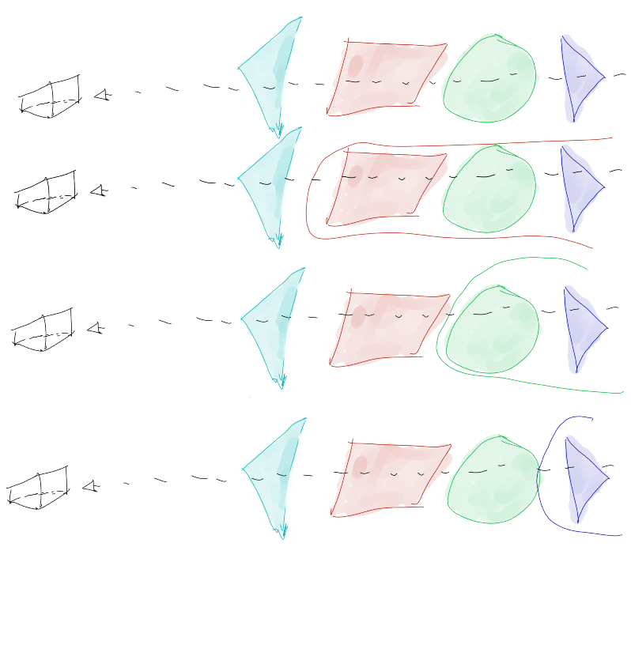

# Volume Rendering with Radiance Fields   
So far, we’ve covered classic volumetric rendering as a foundation for understanding NeRFs. While we know that NeRF stands for **Neural Radiance Field**, we haven’t yet explored what a "radiance field" actually means. Let’s start from there.

The "neural" part is straightforward—it refers to the use of** neural networks**. Essentially, we’re going to rely on neural networks for* somethin*g, but before we dive into how that works, let’s first clarify the "radiance field" part.

In the original NeRF paper, the authors talk about radiance fields as:   
     
*A representation of a scene as the volume density and directional emitted radiance at any point in space.*   
   
This definition may not be that clear, but it’s closely related to the concept of volumetric rendering we’ve already discussed. In classic volumetric rendering, we represent objects and elements like smoke or clouds with properties such as extinction coefficient and density. Here, you can think of a** radiance field** as some kind of volume described by its density at a 3D point in space and what radiance or "color" is perceived from a 2D viewing direction.    
   
      
   
## Representing a radiance field   

Up to this point, the concepts behind radiance fields and volumetric rendering are largely the same. However, the key difference lies in how NeRFs represent these fields using neural networks. Instead of explicitly storing volume data, NeRFs use a neural network to **learn**  and **encode**  the volumetric information. The network takes spatial coordinates $(x, y, z)$ and a viewing direction $(\theta,\phi)$ as inputs, and outputs a color and density for that point in space. This is where the "neural" comes into play: it enables the network to "learn" a static scene from RGB images. In other words, instead of storing the information in a traditional data structure, we train the neural network on the images, which allows us to later query the scene and render novel views.t allows us to "learn" a static scene from our RGB images. That means that, instead of using some kind of data structure to store the information, we "show" our images to a neural network and train it so we can query the data later and render novel views of our scene.     

Let’s break this down into simpler terms. Our goal is to represent a 3D scene. However, rather than explicitly storing all the scene information (as traditional rendering methods would), we allow a neural network to *learn* the scene's details. The network learns the relationship between spatial coordinates and how light interacts with each point in the scene. To render a new view of the scene, we pass a set of coordinates and viewing directions to the network (which essentially forms a ray). The network then returns the radiance and density needed to compute the final image.   
   
With this in mind, our new rendering process would look something like this:   
   
    
   
## Some considerations and the rendering equation   
   
As we’ve already mentioned, the setups for volumetric rendering and NeRF are very similar. Therefore, it’s a good idea to begin with the equation we derived in our volumetric rendering lessons.   
   

$$
T(s)=-exp(-\int_{s'=0}^{s}\sigma_t(x_{x'})ds')

$$

$$
L(x,w) = \int_{s'=0}^{s} T(s')[\sigma_s(x_{s'})L_s(x_{s'},w))]ds' + T(s)L(0)

$$
   
First, lets do a quick recap what each term is:   
- $T(.)$: This is our transmittance, representing the remaining light after it passes through the volume.   
- $\sigma(.)$: This is the density, dependent on the position in space.   
- $L(.)$: This represents the color (radiance), which is dependent on both position and viewing direction.    
- $s$: Represents distance.   
- $w$: Represents the viewing direction.   
- $L\_s(.)$: The in-scatter term or source term, which we will explain shortly.   
- $L(0)$:The initial light reflected from a solid object behind the volume.   
   
   
Besides the different notation. if you read the 2020 paper you will find two main differences between our volumetric rendering equation and the one described in the paper. The first one is the inclusion of $T(s)L(0)$ . As we mentioned, this term accounts for the color reflected by an object behind the volume. However you'll see that for NeRFs the whole scene is modeled as a single volume. With that in mind we end up using $T(s)L(0)$ just to represent our background, and for simplicity we'll stick with a white background.   
The second and more important difference will be in how we interpret Ls​​(.), the in-scatter term. The paper uses this term to represent a view dependant color at a certain distance from the ray in the scene for a given viewing angle. In contrast, If you read our explanation of in-scattering in the ch[apter 6 of the volumetric rendering series](https://www.scratchapixel.com/lessons/3d-basic-rendering/volume-rendering-for-developers/volume-rendering-summary-equations.html), you know that this term includes the influence of external sources on the radiance emitted. The question is, are these two related?. The answer is yes, or at least we can make an interpretation to explain both approaches.   
Don't forget that in-scattering is just the effect of light coming from a different angle, being scattered and redirected to our direction, adding to the beam that travels toward us. But what happens if we consider that those beams might be of different colors. That means that the volume will interact diffcpperent, emitting a different color. But how do we model this? With more neural networks!. We won't model that interactions our selves but rather let the network learn those details. In the end we are still considering in-scattering in the rendering process, but we are letting the network do the hard work on modeling rather than using the phase function.   
   
    
   
One last detail. Since we cannot use infinite boundaries, we will bound our volumetric equation with *near* and *far* bounds:    
   

$$
L(x,w) = \int_{s_n}^{s_f} T(s')[\sigma_s(x_{s'})L_s(x_{s',w}))]ds'
$$
For simplicity we are leaving out the "background" term. But don't worry, we are including it on the implementation.   
## Some rendering and some code:   
Now that we know what we are working with, lets write some code. The first order of business would be, how do we implement the integral?. Well, we don't, we use numeric quadrature, a fancy way to say that we will approximate our equation numerically. We are gonna use this equation:   
   

$$
\alpha_i = 1 - exp(-\sigma_i \delta_i)
$$

$$
L(c,w) = \sum_{i+1}^N ( \alpha_i  L_{s} \prod_{j=1}^{i-1}(1-\alpha_j  ))

$$
That doesn't look anything like our volumetric rendering equation, does ti?, but don't worry. We will formalize this equation later, but for now, here is the easy version. As we mentioned, we are gonna use numeric quadrature to approximate our integral numerically. However while doing that, in the process, we can reduce our equations to classic alpha compositing. This is what the majority of implementation out there do. Just for the sake of consistency we are doing the same. However we are going to elaborate on the math to get there at the end of the lesson. For now here is the code:   
   
```cpp
#include <cmath>

// Color is expresed as an RGB 3-d array
double *computeRadiance(double *sig_density, double *distance_s_array,
                        double **color_array, int num_samples) {

  // Delta computation
  double *delta_array = new double[num_samples];
  for (int i = 0; i < num_samples - 1; i++) {
    delta_array[i] = distance_s_array[i + 1] - distance_s_array[i];
  }
  // The last distance would be infitine since there is no
  // other sample point.
  delta_array[num_samples - 1] = 1e10;

  // alpha computation
  double *alpha_array = new double[num_samples];
  for (int i = 0; i < num_samples; i++)
    alpha_array[i] = 1 - std::exp(-sig_density[i] * delta_array[i]);

  // Compute accumulated alpha multiplication
  // At each point, each multiplication acts as a weight for the
  // color emitted at each point.
  double cumprod = 1;
  double *weight = new double[num_samples];
  for (int i = 0; i < num_samples; i++) {
    cumprod *= (1 - alpha_array[i]);
    weight[i] = cumprod * alpha_array[i];
  }
  // Finally we agregate each color
  double *rgb_color = new double[3];
  rgb_color[0] = 0;
  rgb_color[1] = 0;
  rgb_color[2] = 0;

  for (int i = 0; i < num_samples; i++) {
    rgb_color[0] += rgb_color[0] * weight[i];
    rgb_color[1] += rgb_color[1] * weight[i];
    rgb_color[2] += rgb_color[2] * weight[i];
  }

  double cum_weight = 0;
  for (int i = 0; i < num_samples; i++) {
    cum_weight += weight[i];
  }

  // We composite this over a white background
  rgb_color[0] += (1 - cum_weight);
  rgb_color[1] += (1 - cum_weight);
  rgb_color[2] += (1 - cum_weight);

  return rgb_color;
}

```
   
From the code snippet above we have to mention a few things. For starters, the function we just wrote produces a single RGB color from a single ray. That means that we need to execute this function for each ray from our camera in order to render a full image.    
Also, so far we are using plain C++. That is because we want to focus first on you understanding the theory behind. We will come back to this function and modify so we can work with batch data, multiple rays and actually take advantage of a GPU if you have one available once we understand the basics of NeRFs.   
Hopefully by this point you now understand how a radiance field relates to NeRFs and now we have implemented our rendering function. If you are interested on fully understanding the underlying math that powers this method keep reading since we try to give a detailed explanation on both the equations and how we can reduce it to classic alpha compositing. 
   
However feel free to jump to the next chapter where we'll get into building and training our neural network.    
## Diving into the math   
   
Credits for [YU Yue](https://yconquesty.github.io/blog/ml/nerf/nerf_rendering.html) and his demonstration that served as inspiration for this explanation   
   
We already demonstrated the volumetric rendering on a previous lesson so go check it out if you are curious about it. Just remember that in contrast with that approach, our in-scattering term is somewhat built-in in the neural network. With some idea on how this works, it's time to actually understand where the implementation comes from. Our first order of business is approximating  the volumetric rendering equation.    
   
Our first step is going from a continuous space to a discrete space. That means that between our *near* and *far *we will take a finite amount of samples. Define our set of samples:   

$$
s_{near}  \leq \hat{s}_0 < \hat{s}_1 < \dots < \hat{s}_{n} \leq s_{far}
$$
And our discrete difference between adjacent samples:   

$$
\delta_i  = \hat{s}_{i+1} - \hat{s}_{i} \forall i \in \{ 0,\dots , n-1 \}
$$
Here is important to notice that our difference $\delta$ is the discrete version of $ds$.    
   
As we already established, we are using numerical quadrature. Looking at the rendering equation:   
   

$$
T(s)=-exp(-\int_{s'=0}^{s}\sigma_t(x_{x'})ds')
$$

$$
L(x,w) = \int_{s_n}^{s_f} T(s')[\sigma_s(x_{s'})L_s(x_{s',w}))]ds'
$$
We'll start with the transmittance T(s). If you ever studied calculus you know that we can approximate integral through the Rie*mann Sum. *The transmittance is approximated by:    
   

$$
\begin{split}
T_i & := T(\hat{s}_i) \\
   & \approx -e^{-\sum_{j=0}^{i-1} \sigma_j \delta_j} 
\end{split}


$$
One important clarification is that $T\_i$​ can be thought as a CDF or a cumulaltive distribution function (a concept that we will revisit later). That means that we can see the transmittance as the accumulated probability of a ray **not in**teracting with the medium through a distance $\hat{s}\_i$. We can define the probability of light being blocked as:   
   

$$
H(s) = 1 - T(s)
$$
However what we want to know is the emitted radiance at discrete points. To do that we derive the CDF to obtain what is know as the PDF or Probability Distribute Function. But since we are interested in the discrete case, we are gonna use discrete difference instead of derivatives. That is:   
   

$$
\begin{split}
h_{hit}(\hat{s}_i) & = \frac{dH}{ds} |_{\hat{s}_i} \\
& = H(\hat{s}_{i+1}) - H(\hat{s}_i) \\
& = 1 - T(\hat{s}_{i+1}) - (1  - T(\hat{s}_i)) \\
& = T(\hat{s}_i) - T(\hat{s}_{i+1}) \\ 
& = T(\hat{s}_i)  (1 - \frac{T(\hat{s}_{i+1})}{T(\hat{s}_i)}) \\
& = T(\hat{s}_i) ( 1 - \frac{-e^{\sum_{j=0}^{i} \sigma_j \delta_j} }{-e^{\sum_{j=0}^{i-1} \sigma_j \delta_j} }) \\ 
& =  T(\hat{s}_i) ( 1 - \frac{-e^{\sum_{j=0}^{i-1} \sigma_j \delta_j} \cdot e^{-\sigma_i \delta_i} }{e^{-\sum_{j=0}^{i-1} \sigma_j \delta_j} }) \\
& =  T(\hat{s}_i) ( 1 - e^{-\sigma_i \delta_i} ) \\
\end{split}


$$
The math looks good an all but what does it means? What we just found is the probability of light being blocked by particles at a point $\hat{s}\_i$​. If we multiply this by the radiance at that point we are essentially blocking a portion of light, giving us as results the final radiance at that particular point. From here es easy to figure out the equation to render a full beam of light:
   

$$
\hat{L}(x,w) = \sum_{i=1}^{N} T(\hat{s}_i) ( 1 - e^{-\sigma_i \delta_i} ) L_{s}(x_{\hat{s}_i},w)
$$
This is the result of using numerical quadrature to approximate the volumetric rendering equation. Notice that we omitted the background term for simplicity but in the end it resolves as an extra sum.   
## Resembling alpha compositing   
   
We mentioned before that the equation can be reduce to classical alpha compositing. An doing that is actually very easy but first we need to understand how alpha compositing works.   
Imagine that we have a foreground and a background object and the foreground have some sort of transparency. This transparency is what we usually refer to as alpha. Because of this alpha, both the foreground and the background will contribute to the final color. This is the formula to compute this:   

$$
c = \alpha c_f + (1-\alpha)c_b
$$
From here we can generalize for multiple objects. Our setup would look something like this:
   
    
Under this setup, we can take a recursive approach. We will take the closest object from our view and group the remaining and treating the group as a single element. From here we will break down each group, taking one element at a time until we are left with two simple elements. Representing this process with math would look something like this:
   

$$
c = \alpha_1c_1 + (1-\alpha_1)( \alpha_2 c_2 + (1-\alpha_2)( \alpha_3 c_3 + (1-\alpha_3)( \alpha_4 c_4 + (1-\alpha_4)(\dots) ) ))


$$
   
If we work the math a little bit we wan express this in a generalized form:
   
   

$$
\begin{split}
c  =  \alpha_1c_1  & + (1-\alpha_1)\alpha_2 c_2  \\
& + (1-\alpha_1)(1-\alpha_2)( \alpha_3 c_3 + (1-\alpha_3)( \alpha_4 c_4 + (1-\alpha_4)(\dots) ) ) \\
c  =  \alpha_1c_1  & + (1-\alpha_1)\alpha_2 c_2  \\
& + (1-\alpha_1)(1-\alpha_2)\alpha_3 c_3 \\ 
& + (1-\alpha_1)(1-\alpha_2)(1-\alpha_3)( \alpha_4 c_4 + (1-\alpha_4)(\dots) ) \\ 
c  =  \alpha_1c_1  & + (1-\alpha_1)\alpha_2 c_2  \\
& + (1-\alpha_1)(1-\alpha_2)\alpha_3 c_3 \\ 
& + (1-\alpha_1)(1-\alpha_2)(1-\alpha_3)\alpha_4 c_4 \\
&+ (1-\alpha_1)(1-\alpha_2)(1-\alpha_3)(1-\alpha_4)(\dots) \\

& = \sum_{i=1}^n \alpha_i c_i  \prod_{j=1}^{i-1}(1  - \alpha_j)
\end{split}


$$
This is already very similar to our discrete volumetric rendering function. Now, if we consider $1 - \alpha\_i = e^{-\sigma\_i \delta\_i}$ then:   
   

$$
\begin{split}
\prod_{j=1}^{i-1}(1  - \alpha_j) & = \prod_{j=1}^{i-1}e^{-\sigma_i \delta_i} \\
& = e^{\sum_{j=1}^{i-1} - \sigma_j \delta_j } \\
T(\hat{s}_i) & = e^{\sum_{j=1}^{i-1} - \sigma_j \delta_j }
\end{split}


$$
Hence:   
   

$$
\begin{split}
c & = \sum_{i=1}^{N} ( 1 - e^{-\sigma_i \delta_i} ) c_iT(\hat{s}_i)  \\
\hat{L}(x,w) & = \sum_{i=1}^{N} T(\hat{s}_i) ( 1 - e^{-\sigma_i \delta_i} ) L_{s}(x_{\hat{s}_i},w) \\
\end{split}

$$
   
Now we have demonstrated that the discrete volumetric rendering equation we are using is equivalent to classic alpha compositing when $1 - \alpha\_i = e^{-\sigma\_i \delta\_i}$. However most of the implementations of NeRFs out there will use the alpha compositing equation instead volumetric rendering one.   
If you made it so far congratulations, now you fully understand how the method works and the math that makes this technique possible. In the next chapter we will  discuss the neural network we'll be using, how to build it using C++ and Pytorch, prepare training data and training our neural network.   
   
